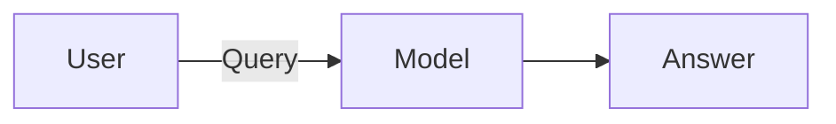
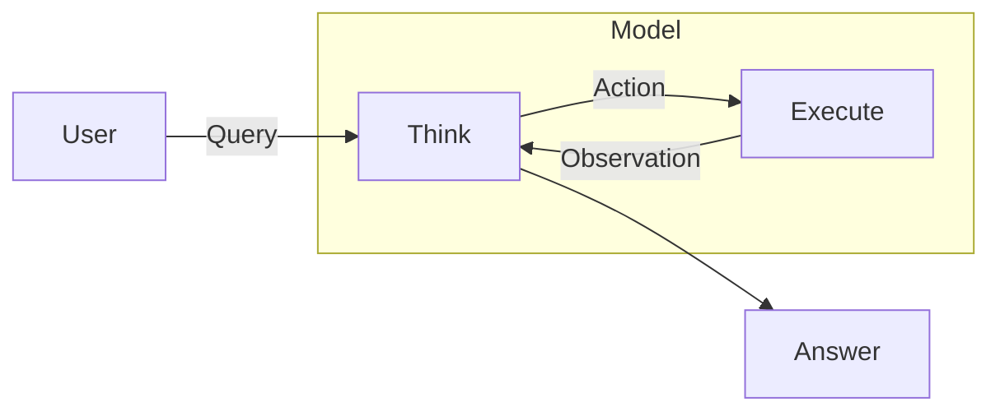

# 1 · Foundation

What Claude is, what "agentic" means, and how tools fit in

---

# What is Claude?

Claude is a family of LLMs from Anthropic, exposed through **4 products**:

### 💬 Claude Chat
One-shot conversational assistant

### 🤝 Claude Cowork
Long-running collaborative agent on your workspace

### ⌨️ Claude Code
**Today's focus.** CLI / IDE coding agent

### 🎨 Claude Design
Design generation agent

<!--
The 4 products share the same model family but differ in surface and capability.
We're focusing on Claude Code because it's the one developers integrate into their daily workflow.
-->

---
layout: two-cols-header
---

# Chat vs Agent

The difference between a chatbot and an agent is **the loop**.

::left::

### 💬 Chat = one-shot

- Single round-trip
- No external action
- No state between turns

::right::

### 🤖 Agent = ReAct loop

- Reason → Act → Observe → repeat
- Calls **tools** (read file, bash, web fetch…)
- Builds context across turns

<!--
ReAct = Reasoning + Acting. The model alternates between thinking ("I need to read this file")
and acting ("call Read tool"). The loop ends when the model decides it has enough to answer.
This is the core mechanism behind Claude Code, Cowork, and Design.
-->

---
layout: two-cols-header
---

# Tools: the agent's hands

An agent without tools is just a chatbot. Two categories:

::left::

### Built-in tools

Ship with Claude Code:

- `Read`, `Write`, `Edit`
- `Bash`, `Glob`, `Grep`
- `WebFetch`, `WebSearch`
- `Task` (subagents)
- `TodoWrite`

[📖 [code.claude.com/docs/en/tools-reference](https://code.claude.com/docs/en/tools-reference)]{.text-sm .opacity-60}

::right::

### External tools

Plug in your own:

- **MCP servers** (Model Context Protocol)
  - GitHub, Slack, Notion, Postgres…
  - Anything with an MCP adapter
- **Plugins**: bundles of commands + agents + hooks + MCP

<!--
MCP is Anthropic's open standard for tool servers — like LSP but for AI tools.
Hundreds of community MCP servers exist. Plugins are a higher-level packaging.
-->

---
layout: center
class: text-center
---

# 🔑 Mental model

> Claude Code = **LLM** + **agentic loop** + **tools** + **your project**

Everything else (hooks, skills, commands, memory) is about **shaping that loop**.

<!--
Anchor this mental model — it'll come back in every slide for the rest of the workshop.
The rest is about controlling: what the loop sees, what it can do, when it can do it.
-->
