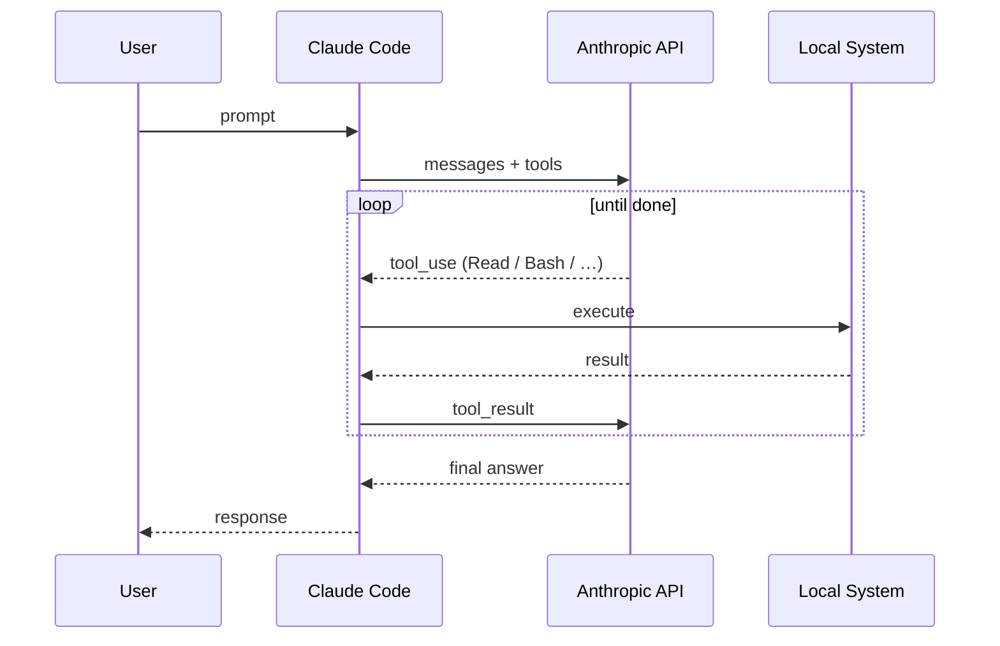
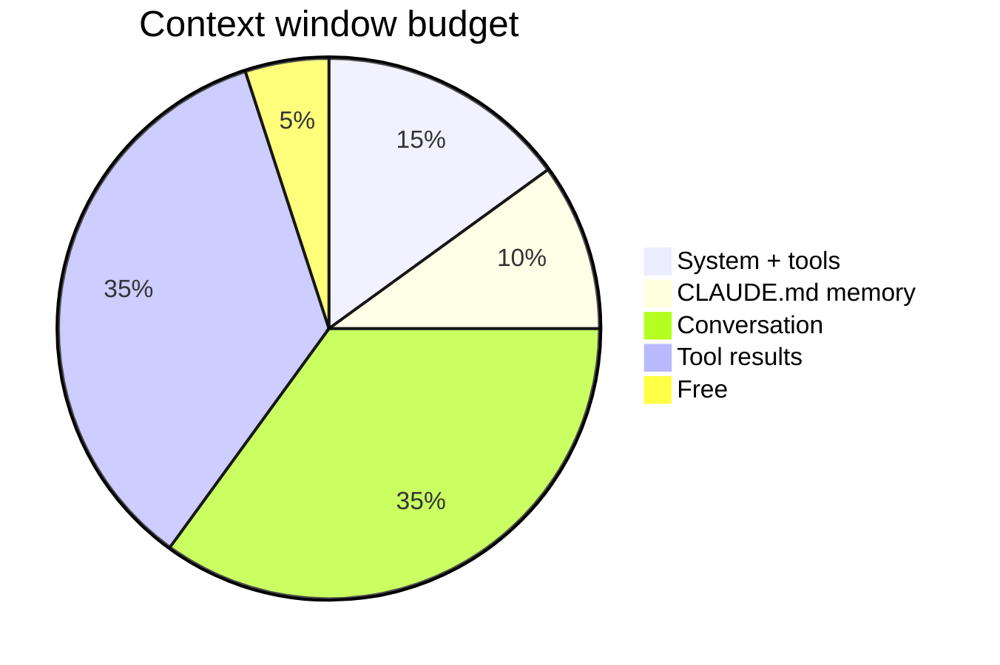

# 2 · Under the hood

Request flow · Context engineering · Memory

---

# A naive view of the request flow

<div class="text-center">



Claude Code orchestrates between **you**, the **model**, and your **machine**.

</div>

<!--
This is the simplified picture. The real picture has a lot more layers — that's what hooks expose.
Walk through one full round-trip: user types prompt, CLI packages context + tool definitions,
sends to API, model responds with tool_use, CLI executes, sends result back, repeat until done.
-->

---
layout: two-cols-header
class: text-sm
---

# The reality: hooks are everywhere

That naive view hides a much richer lifecycle. Every step is **hookable**.

::left::

**Session lifecycle**
- `SessionStart`, `SessionEnd`

**Per-turn**
- `UserPromptSubmit`, `Stop`
- `StopFailure`

**Agentic loop**
- `PreToolUse`, `PostToolUse`
- `PostToolUseFailure`
- `PermissionRequest`, `PermissionDenied`
- `PostToolBatch`

[~28 hook events across 5 categories.\
📖 [code.claude.com/docs/en/hooks](https://code.claude.com/docs/en/hooks)]{.text-sm .opacity-60}

::right::

**Subagents & tasks**
- `SubagentStart`, `SubagentStop`
- `TaskCreated`, `TaskCompleted`

**Files & config**
- `InstructionsLoaded`, `FileChanged`
- `CwdChanged`, `ConfigChange`
- `WorktreeCreate`, `WorktreeRemove`

**Context mgmt**
- `PreCompact`, `PostCompact`

**MCP**
- `Elicitation`, `ElicitationResult`

<!--
Don't read every event — just point out the categories. The takeaway is: every meaningful state
transition emits an event you can intercept.
-->

---
layout: two-cols
---

# Hook lifecycle

Each event passes JSON over stdin to your handler, which can:

- ✅ allow
- ❌ block (exit code 2)
- 🔄 modify the input
- 💬 inject a message

[📖 [code.claude.com/docs/en/hooks](https://code.claude.com/docs/en/hooks)]{.text-sm .opacity-60}

::right::


<!--
The diagram on the right is from the official docs. Walk through it:
SessionStart → UserPromptSubmit → (loop: PreToolUse → tool runs → PostToolUse) → Stop.
Each box is an interception point.
-->

---
class: text-sm
---

# Hook handler types

Hooks aren't just shell scripts, 5 handler types:

| Type       | What it is                           | Use case                                   |
| ---------- | ------------------------------------ | ------------------------------------------ |
| `command`  | Shell command, JSON via stdin/stdout | Block destructive bash, run linters        |
| `http`     | POST to HTTP endpoint                | Centralized policy server, audit log       |
| `mcp_tool` | Call a tool on an MCP server         | Notion logging, Slack notifications        |
| `prompt`   | Single LLM call                      | Classify a prompt, soft policy enforcement |
| `agent`    | Subagent with full tool access       | Complex multi-step gating                  |

[Configured in `~/.claude/settings.json`, `.claude/settings.json`, or plugin `hooks/hooks.json`.]{.text-sm .opacity-60}

<!--
The progression goes from cheapest (command) to most capable (agent). Use the simplest type
that solves your problem.
-->

---

# Hook example: block `rm -rf`

````md magic-move
```json
// .claude/settings.json
{
  "hooks": {
    "PreToolUse": [
      {
        "matcher": "Bash",
        "hooks": [{
          "type": "command",
          "command": ".claude/hooks/block-rm.sh"
        }]
      }
    ]
  }
}
```

```bash
#!/bin/bash
# .claude/hooks/block-rm.sh
COMMAND=$(jq -r '.tool_input.command')

if echo "$COMMAND" | grep -q 'rm -rf'; then
  jq -n '{
    hookSpecificOutput: {
      hookEventName: "PreToolUse",
      permissionDecision: "deny",
      permissionDecisionReason: "Destructive command blocked"
    }
  }'
else
  exit 0
fi
```
````

<!--
Walk through both panes. First: the wiring in settings.json. Second: the actual handler.
Note the JSON contract — input via stdin, decision via stdout, exit codes for fast paths.
-->

---

# Permission modes

How aggressive should the agent be?

| Mode                | Behavior                                | When to use                           |
| ------------------- | --------------------------------------- | ------------------------------------- |
| `default`           | Asks for risky tools                    | Daily work                            |
| `acceptEdits`       | Auto-allow file edits, ask for the rest | Heads-down coding                     |
| `plan`              | Read-only — produces a plan, no actions | Architecture, before destructive work |
| `bypassPermissions` | ⚠️ No prompts, ever                      | Sandbox / CI / disposable VM          |

```bash
claude --permission-mode plan        # CLI flag
# or in-session:
/permissions
```

<!--
Plan mode is criminally underused — it's how you get Claude to think hard before touching anything.
bypassPermissions should NEVER be used outside an isolated environment.
-->

---

# Checkpointing: local undo for the agent

Every prompt snapshots the code. Press `Esc` `Esc` or run `/rewind` to travel back.

<div class="timeline">

<div class="ckpt" style="--c: #bd93f9">
<div class="ckpt-icon">📸</div>
<div class="ckpt-label">ckpt-1</div>
<div class="ckpt-box">Prompt 1<br/><span class="opacity-60">scaffold</span></div>
</div>

<div class="arrow" style="--c: #bd93f9">→</div>

<div class="ckpt" style="--c: #bd93f9">
<div class="ckpt-icon">📸</div>
<div class="ckpt-label">ckpt-2</div>
<div class="ckpt-box">Prompt 2<br/><span class="opacity-60">add auth</span></div>
</div>

<div class="arrow" style="--c: #bd93f9">→</div>

<div class="ckpt" style="--c: #ff5555">
<div class="ckpt-icon">📸</div>
<div class="ckpt-label">ckpt-3</div>
<div class="ckpt-box">Prompt 3<br/><span class="opacity-60">⚠️ broke tests</span></div>
</div>

<div class="arrow" style="--c: #ffb86c">⏪</div>

<div class="ckpt" style="--c: #ffb86c">
<div class="ckpt-icon">🎯</div>
<div class="ckpt-label">rewind</div>
<div class="ckpt-box">back to<br/><span class="opacity-60">ckpt-2</span></div>
</div>

</div>

<style scoped>
.timeline {
  display: flex;
  align-items: center;
  justify-content: space-between;
  gap: 0.5rem;
  margin: 1rem 0;
  padding: 0 0.5rem;
}
.ckpt {
  display: flex;
  flex-direction: column;
  align-items: center;
  gap: 0.25rem;
  flex: 1;
}
.ckpt-icon { font-size: 1.5rem; }
.ckpt-label {
  font-size: 0.75rem;
  font-weight: 700;
  color: var(--c);
}
.ckpt-box {
  border-radius: 0.375rem;
  padding: 0.25rem 0.5rem;
  border: 1px solid color-mix(in srgb, var(--c) 40%, transparent);
  background: color-mix(in srgb, var(--c) 10%, transparent);
  font-size: 0.75rem;
  text-align: center;
  width: 100%;
}
.arrow {
  font-size: 1.25rem;
  color: var(--c);
}
</style>

<br>Once you pick a prompt in the rewind menu, choose **what** to roll back:

<div class="grid grid-cols-4 gap-3">

<div class="action-card" style="--c: #bd93f9">
<div class="action-card-title">🔄 Code + chat</div>
<div class="action-card-desc">Full rewind to that prompt</div>
</div>

<div class="action-card" style="--c: #8be9fd">
<div class="action-card-title">💬 Chat only</div>
<div class="action-card-desc">Keep code, replay conv.</div>
</div>

<div class="action-card" style="--c: #50fa7b">
<div class="action-card-title">📁 Code only</div>
<div class="action-card-desc">Undo edits, keep memory</div>
</div>

<div class="action-card" style="--c: #ffb86c">
<div class="action-card-title">📝 Summarize</div>
<div class="action-card-desc">Targeted <code>/compact</code> from here</div>
</div>

</div>

<style scoped>
.action-card {
  border-radius: 0.5rem;
  padding: 0.75rem;
  border: 1px solid color-mix(in srgb, var(--c) 40%, transparent);
  background: color-mix(in srgb, var(--c) 10%, transparent);
}
.action-card-title {
  color: var(--c);
  font-weight: 700;
}
.action-card-desc {
  opacity: 0.8;
  font-size: 0.75rem;
  margin-top: 0.25rem;
}
</style>

<div class="grid grid-cols-2 gap-4 mt-4">

<div>
<div class="text-green-400 font-bold">✅ Tracked</div>

- Edits via Claude's file tools
- Persists across sessions · 30-day TTL
</div>

<div>
<div class="text-red-400 font-bold">❌ Not tracked</div>

- Bash side-effects (`rm`, `mv`, `cp`)
- External / concurrent edits
</div>

</div>

[💡 Local undo — Git is still your permanent history · 📖 [code.claude.com/docs/en/checkpointing](https://code.claude.com/docs/en/checkpointing)]{.text-sm .opacity-60}

<!--
Esc Esc is the muscle-memory shortcut. /rewind opens the same menu.
"Summarize from here" is the underrated option — it's like /compact but only compresses the tail,
keeping your initial instructions in full detail.
-->

---
layout: two-cols-header
---

# Context engineering, why it matters

Everything Claude "knows" comes from the context window.

::left::

**What's in the context?**
- System prompt
- `CLAUDE.md` files (memory)
- Tool definitions
- Conversation history
- Tool results (file contents, bash output)
- Skills loaded

**What's NOT?**
- Anything you didn't show it
- Anything that scrolled out

::right::



<!--
This is the single most important concept of the workshop. If you understand the context window,
you understand 80% of what makes Claude Code effective or not.
-->

---
layout: image
image: /context-window.svg
backgroundSize: contain
---

<!--
Source: platform.claude.com/docs/en/build-with-claude/context-windows
Walk through the diagram: how the window fills up, what gets included, what gets evicted.
-->

---

# `/context` see what's in there

<div class="ctx-card">
  <div class="ctx-cmd">&rsaquo; /context</div>
  <div class="ctx-title">Context Usage</div>
  <div class="ctx-body">
    <div class="ctx-grid">
      <span class="d sys"></span><span class="d sys"></span><span class="d sys"></span><span class="d tools"></span><span class="d skills"></span><span class="d msg"></span><span class="d free"></span><span class="d free"></span><span class="d free"></span><span class="d free"></span><span class="d free"></span><span class="d free"></span><span class="d free"></span><span class="d free"></span><span class="d free"></span><span class="d free"></span>
      <span class="d free"></span><span class="d free"></span><span class="d free"></span><span class="d free"></span><span class="d free"></span><span class="d free"></span><span class="d free"></span><span class="d free"></span><span class="d free"></span><span class="d free"></span><span class="d free"></span><span class="d free"></span><span class="d free"></span><span class="d free"></span><span class="d free"></span><span class="d free"></span>
      <span class="d free"></span><span class="d free"></span><span class="d free"></span><span class="d free"></span><span class="d free"></span><span class="d free"></span><span class="d free"></span><span class="d free"></span><span class="d free"></span><span class="d free"></span><span class="d free"></span><span class="d free"></span><span class="d free"></span><span class="d free"></span><span class="d free"></span><span class="d free"></span>
      <span class="d free"></span><span class="d free"></span><span class="d free"></span><span class="d free"></span><span class="d free"></span><span class="d free"></span><span class="d free"></span><span class="d free"></span><span class="d free"></span><span class="d free"></span><span class="d free"></span><span class="d free"></span><span class="d free"></span><span class="d free"></span><span class="d free"></span><span class="d free"></span>
      <span class="d free"></span><span class="d free"></span><span class="d free"></span><span class="d free"></span><span class="d free"></span><span class="d free"></span><span class="d free"></span><span class="d free"></span><span class="d free"></span><span class="d free"></span><span class="d free"></span><span class="d free"></span><span class="d free"></span><span class="d free"></span><span class="d free"></span><span class="d free"></span>
      <span class="d free"></span><span class="d free"></span><span class="d free"></span><span class="d free"></span><span class="d free"></span><span class="d free"></span><span class="d free"></span><span class="d free"></span><span class="d free"></span><span class="d free"></span><span class="d free"></span><span class="d free"></span><span class="d free"></span><span class="d free"></span><span class="d free"></span><span class="d free"></span>
      <span class="d free"></span><span class="d free"></span><span class="d free"></span><span class="d free"></span><span class="d free"></span><span class="d free"></span><span class="d free"></span><span class="d free"></span><span class="d free"></span><span class="d free"></span><span class="d free"></span><span class="d free"></span><span class="d free"></span><span class="d free"></span><span class="d free"></span><span class="d free"></span>
      <span class="d free"></span><span class="d free"></span><span class="d free"></span><span class="d free"></span><span class="d free"></span><span class="d free"></span><span class="d free"></span><span class="d free"></span><span class="d free"></span><span class="d free"></span><span class="d free"></span><span class="d free"></span><span class="d free"></span><span class="d free"></span><span class="d free"></span><span class="d free"></span>
      <span class="d free"></span><span class="d free"></span><span class="d free"></span><span class="d free"></span><span class="d free"></span><span class="d free"></span><span class="d free"></span><span class="d free"></span><span class="d free"></span><span class="d ac"></span><span class="d ac"></span><span class="d ac"></span><span class="d ac"></span><span class="d ac"></span><span class="d ac"></span><span class="d ac"></span>
    </div>
    <div class="ctx-legend">
      <div class="model">Opus 4.7 (1M context)</div>
      <div class="model-id">claude-opus-4-7[1m]</div>
      <div class="total">20.7k/1m tokens <span class="dim">(2%)</span></div>
      <div class="section">Estimated usage by category</div>
      <div class="row"><span class="dot sys"></span> System prompt: <em>8.7k tokens (0.9%)</em></div>
      <div class="row"><span class="dot tools"></span> System tools: <em>10.9k tokens (1.1%)</em></div>
      <div class="row"><span class="dot skills"></span> Skills: <em>1.1k tokens (0.1%)</em></div>
      <div class="row"><span class="dot msg"></span> Messages: <em>13 tokens (0.0%)</em></div>
      <div class="row"><span class="dot free"></span> Free space: <em>946.3k (94.6%)</em></div>
      <div class="row"><span class="dot ac"></span> Autocompact buffer: <em>33k tokens (3.3%)</em></div>
    </div>
  </div>
</div>

<style>
.ctx-card {
  background: #1e1e2e;
  color: #cdd6f4;
  border-radius: 8px;
  padding: 1rem 1.25rem;
  font-family: ui-monospace, SFMono-Regular, Menlo, monospace;
  font-size: 0.78em;
  line-height: 1.5;
}
.ctx-cmd   { color: #cdd6f4; }
.ctx-title { color: #cdd6f4; font-weight: 700; padding: 0.15rem 0.4rem; background: #313244; display: inline-block; border-radius: 3px; margin: 0.4rem 0 0.6rem 1rem; }
.ctx-body  { display: grid; grid-template-columns: auto 1fr; gap: 1.2rem; padding-left: 1rem; border-left: 1px solid #45475a; margin-left: 0.4rem; }
.ctx-grid  { display: grid; grid-template-columns: repeat(16, 1.1rem); gap: 0.25rem 0.2rem; align-content: start; }
.d         { width: 1.1rem; height: 1.1rem; background-color: currentColor; -webkit-mask: var(--db) center/contain no-repeat; mask: var(--db) center/contain no-repeat; --db: url("data:image/svg+xml;utf8,%3Csvg xmlns='http://www.w3.org/2000/svg' viewBox='0 0 24 22'%3E%3Cellipse cx='12' cy='3' rx='10' ry='2.2'/%3E%3Cpath d='M2 3 v5 c0 1.2 4.5 2.2 10 2.2 s10-1 10-2.2 V3 c0 1.2 -4.5 2.2 -10 2.2 S2 4.2 2 3 Z'/%3E%3Cpath d='M2 9 v5 c0 1.2 4.5 2.2 10 2.2 s10-1 10-2.2 V9 c0 1.2 -4.5 2.2 -10 2.2 S2 10.2 2 9 Z'/%3E%3Cpath d='M2 15 v4 c0 1.2 4.5 2.2 10 2.2 s10-1 10-2.2 v-4 c0 1.2 -4.5 2.2 -10 2.2 S2 16.2 2 15 Z'/%3E%3C/svg%3E"); color: #45475a; }
.d.sys     { color: #89b4fa; }
.d.tools   { color: #74c7ec; }
.d.skills  { color: #f9e2af; }
.d.msg     { color: #cba6f7; }
.d.free    { color: #45475a; --db: url("data:image/svg+xml;utf8,%3Csvg xmlns='http://www.w3.org/2000/svg' viewBox='0 0 24 24' fill='black'%3E%3Cpath d='M2 2h7v2H4v5H2zM22 2h-7v2h5v5h2zM2 22h7v-2H4v-5H2zM22 22h-7v-2h5v-5h2z'/%3E%3C/svg%3E"); }
.d.ac      { color: #6c7086; --db: url("data:image/svg+xml;utf8,%3Csvg xmlns='http://www.w3.org/2000/svg' viewBox='0 0 24 24'%3E%3Crect x='2' y='2' width='20' height='20' fill='none' stroke='black' stroke-width='2'/%3E%3Cline x1='2' y1='2' x2='22' y2='22' stroke='black' stroke-width='2'/%3E%3Cline x1='22' y1='2' x2='2' y2='22' stroke='black' stroke-width='2'/%3E%3C/svg%3E"); }
.ctx-legend .model    { color: #cdd6f4; }
.ctx-legend .model-id { color: #6c7086; }
.ctx-legend .total    { color: #cdd6f4; margin-bottom: 0.6rem; }
.ctx-legend .dim      { color: #6c7086; }
.ctx-legend .section  { color: #6c7086; font-style: italic; margin-bottom: 0.3rem; }
.ctx-legend .row      { color: #cdd6f4; }
.ctx-legend .row em   { color: #6c7086; font-style: normal; }
.dot { display: inline-block; width: 0.95rem; height: 0.95rem; vertical-align: -3px; margin-right: 0.25rem; background-color: currentColor; -webkit-mask: var(--db) center/contain no-repeat; mask: var(--db) center/contain no-repeat; --db: url("data:image/svg+xml;utf8,%3Csvg xmlns='http://www.w3.org/2000/svg' viewBox='0 0 24 22'%3E%3Cellipse cx='12' cy='3' rx='10' ry='2.2'/%3E%3Cpath d='M2 3 v5 c0 1.2 4.5 2.2 10 2.2 s10-1 10-2.2 V3 c0 1.2 -4.5 2.2 -10 2.2 S2 4.2 2 3 Z'/%3E%3Cpath d='M2 9 v5 c0 1.2 4.5 2.2 10 2.2 s10-1 10-2.2 V9 c0 1.2 -4.5 2.2 -10 2.2 S2 10.2 2 9 Z'/%3E%3Cpath d='M2 15 v4 c0 1.2 4.5 2.2 10 2.2 s10-1 10-2.2 v-4 c0 1.2 -4.5 2.2 -10 2.2 S2 16.2 2 15 Z'/%3E%3C/svg%3E"); }
.dot.sys    { color: #89b4fa; }
.dot.tools  { color: #74c7ec; }
.dot.skills { color: #f9e2af; }
.dot.msg    { color: #cba6f7; }
.dot.free   { color: #45475a; --db: url("data:image/svg+xml;utf8,%3Csvg xmlns='http://www.w3.org/2000/svg' viewBox='0 0 24 24' fill='black'%3E%3Cpath d='M2 2h7v2H4v5H2zM22 2h-7v2h5v5h2zM2 22h7v-2H4v-5H2zM22 22h-7v-2h5v-5h2z'/%3E%3C/svg%3E"); }
.dot.ac     { color: #6c7086; --db: url("data:image/svg+xml;utf8,%3Csvg xmlns='http://www.w3.org/2000/svg' viewBox='0 0 24 24'%3E%3Crect x='2' y='2' width='20' height='20' fill='none' stroke='black' stroke-width='2'/%3E%3Cline x1='2' y1='2' x2='22' y2='22' stroke='black' stroke-width='2'/%3E%3Cline x1='22' y1='2' x2='2' y2='22' stroke='black' stroke-width='2'/%3E%3C/svg%3E"); }
</style>

**Habits to build:**
- Run `/context` when responses get sluggish or off-base
- Use `/compact` before it spirals
- Start fresh sessions when scope changes

<!--
Demo this live during hands-on. The visualization is what makes it click —
suddenly people understand why their session degraded.
-->

---

# Memory hierarchy

Persistent context across sessions, in 3 layers:

| Layer         | Path                  | Scope        | Use for                                |
| ------------- | --------------------- | ------------ | -------------------------------------- |
| **Personal**  | `~/.claude/CLAUDE.md` | All projects | Your style, tools, preferences         |
| **Project**   | `<repo>/CLAUDE.md`    | One project  | Architecture, conventions, constraints |
| **Directory** | `<dir>/CLAUDE.md`     | Subtree      | Local rules (frontend vs backend)      |

```text
~/.claude/CLAUDE.md           ← always loaded
my-project/
├── CLAUDE.md                 ← loaded when working here
├── frontend/
│   └── CLAUDE.md             ← loaded for frontend tasks
└── backend/
    └── CLAUDE.md             ← loaded for backend tasks
```

<!--
The hierarchy is automatic — Claude Code walks up from CWD and collects all CLAUDE.md files.
Keep them lean: the more memory, the less context budget for actual work.
-->

---

# What goes in `CLAUDE.md`?

````md magic-move
```md
# Project: my-saas

This is a Next.js 15 + Postgres app. We use:
- pnpm (not npm)
- Drizzle ORM
- Tailwind v4
- Vitest for unit tests, Playwright for E2E

Always run `pnpm typecheck && pnpm test` after changes.
Never commit without running `pnpm lint --fix`.
```

```md
# Project: my-saas

## Stack
Next.js 15 · Postgres · Drizzle · Tailwind v4 · Vitest · Playwright

## Conventions
- Package manager: **pnpm** (npm/yarn forbidden)
- Tests live next to source: `foo.ts` ↔ `foo.test.ts`
- Server components by default; mark `'use client'` explicitly

## Commands
- `pnpm dev` — start dev server
- `pnpm typecheck && pnpm test` — must pass before commit
- `pnpm db:migrate` — apply migrations

## Don'ts
- Don't add new ORMs or test runners — use what's here
- Don't bypass auth middleware in `app/api/`
```
````

<v-click at="1">

💡 Structured Markdown is easier for the model to use.

</v-click>

<!--
Show the evolution: from prose to structured. Structured is easier for the model to use
without re-reading the whole file.
-->

---

# Auto memory

Claude can also **maintain its own memory** about you.

```
~/.claude/projects/<project-id>/memory/
├── MEMORY.md                      ← index, always loaded
├── user_role.md                   ← who you are
├── feedback_testing.md            ← corrections you've given
├── project_release_freeze.md      ← project context
└── reference_grafana.md           ← pointers to external systems
```

Claude organises its memory into several categories (by convention, not enforced):
- **user** — your role, preferences, expertise
- **feedback** — corrections that should stick
- **project** — current state of the work
- **reference** — pointers to external systems (Linear, Grafana, Slack…)

<!--
This is opt-in behavior driven by the system prompt. Claude saves what it learns about you
across conversations, building up a profile so it doesn't have to re-learn each session.
-->
