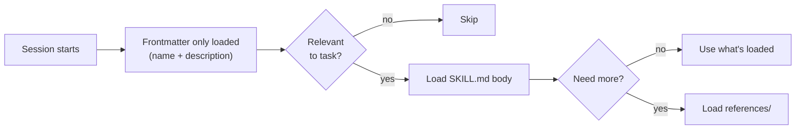

# 3 · Customization

Slash commands · Rules · Skills

---
layout: two-cols-header
---

# Slash commands

Type `/` and run a parameterized prompt.

::left::

### Built-in
- `/context` — show context usage
- `/memory` — view memory layers
- `/permissions` — switch mode
- `/hooks` — list configured hooks
- `/agents` — list subagents
- `/compact` — force context compaction
- `/clear` — wipe session

::right::

### Custom — bring your own

```bash
.claude/commands/review-pr.md   # project
~/.claude/commands/release.md   # personal
```

```md
---
description: Review the current PR
---
Read the diff via `gh pr diff`,
flag risks, suggest tests.
```

[⚠️ Slash commands are increasingly being superseded by **Skills**]{.text-sm .opacity-60}

<!--
Slash commands = fixed prompts, user-triggered.
Skills = auto-invoked, model-triggered.
Use commands for "I always want to do X this way" workflows.
-->

---
layout: two-cols-header
---

# Rules: `.claude/rules/`

Split a bloated `CLAUDE.md` into **modular** instruction files.

::left::

```text
your-project/
├── .claude/
│   ├── CLAUDE.md            # main project rules
│   └── rules/
│       ├── code-style.md    # always loaded
│       ├── testing.md       # always loaded
│       ├── api-design.md    # path-scoped
│       └── frontend/
│           └── react.md     # path-scoped
```

::right::

- One topic per file → easier to maintain
- Discovered **recursively** under `.claude/rules/`
- Personal rules live in `~/.claude/rules/`
- Symlink-friendly → share rules across repos

<!--
Rules without `paths:` load at session start (same priority as .claude/CLAUDE.md).
Use the InstructionsLoaded hook to debug what actually got loaded.
-->

---

# Path-scoped rules

Add a `paths:` frontmatter to load a rule **only** when Claude touches matching files.

```md
---
paths:
  - "src/api/**/*.ts"
  - "lib/**/*.{ts,tsx}"
---

# API rules

- All endpoints must validate input
- Use the standard error envelope
- Include OpenAPI doc comments
```

[→ Saves context budget: the rule is injected on demand, not every session]{.text-sm .opacity-60}

<!--
Path-scoped rules trigger when Claude reads a matching file — not on every tool call.
Use the InstructionsLoaded hook to debug what actually got loaded.
-->

---
layout: two-cols-header
---

# What is a Skill?

A **skill** = a packaged set of instructions + references that Claude **invokes itself** when relevant.

::left::

### When to reach for a skill
- Reusable workflow ("how to debug Y")
- Domain expertise (LaTeX, Postgres, K8s)
- Security policy ("how we review PRs")
- Toolchain conventions

::right::

### Anatomy

```text
~/.claude/skills/my-skill/
├── SKILL.md          ← required
├── README.md         ← optional
├── references/       ← lazy-loaded
└── scripts/          ← executable helpers
```

```yaml
---
name: my-skill
description: One-liner — discovery signal.
---

# Skill content
Step-by-step instructions, gotchas.
```

<!--
The big mental shift: with skills, you teach Claude once and it remembers WHEN to use it.
The frontmatter description is critical — it's what Claude reads to decide whether to load
the rest. Bad description = skill never triggers.
-->

---

# Progressive disclosure

Skills are designed to keep context lean.



[You can have **hundreds** of skills installed without bloating your context. Only the relevant ones are pulled in, and only as much as needed.]{.text-sm .opacity-70}

<!--
This is why skills scale where slash commands don't. Loading a 200-line slash command
into every session is wasteful. Loading a skill's frontmatter is cheap.
-->

---

# Locations & precedence

| Path                            | Scope               | Shareable    |
| ------------------------------- | ------------------- | ------------ |
| `~/.claude/skills/<name>/`      | All projects        | No           |
| `<repo>/.claude/skills/<name>/` | One project         | Yes (commit) |
| Plugin-bundled skills           | When plugin enabled | Yes          |

<!--
Project-level skills are how you encode team practices. New hires get them automatically
when they clone the repo.
-->

---

# Creating a skill

Three paths, in increasing automation:

<div class="cards">

<div>

### 1. By hand
mkdir, write SKILL.md with frontmatter, done.

\
Best for: simple, focused skills.

</div>

<div>

### 2. With Claude
"Create a skill that does X." Claude generates the structure.

Best for: typical case.

</div>

<div class="highlight">

### 3. skill-creator
Anthropic's meta-skill (must be enabled first). Asks the right questions, validates output.

Best for: production skills.

</div>

</div>

```bash
# Use skill-creator to scaffold your own skill
> create a skill that reviews our Terraform changes against our internal naming conventions and tagging policy
```

<style scoped>
.cards { display: grid; grid-template-columns: repeat(3, 1fr); gap: 1rem; margin-top: 1.5rem; margin-bottom: 1.5rem; }
.cards > div { border: 1px solid rgb(55, 65, 81); border-radius: 0.375rem; padding: 1rem; }
.cards > div.highlight { border: 2px solid rgb(249, 115, 22); }
.cards h3 { color: rgb(251, 146, 60); }
.cards p { font-size: 0.75rem; opacity: 0.7; margin-top: 0.5rem; }
</style>

<!--
skill-creator is a skill-about-skills. It enforces the right structure, asks the questions
you'd forget (description, when to invoke, references), and validates the output.
-->

---
layout: two-cols-header
---

# skills.sh — the community marketplace

::left::

🌐 [**skills.sh**](https://skills.sh)

- Search community skills
- One-line install
- Categories: testing, infra, frontend, security…

```bash
# Install a skill via the skills CLI
npx skills add <owner>/<repo>
```

::right::

<div class="warning">

### ⚠️ Security warning

**Always read a skill's `SKILL.md` before installing.**

A skill = instructions Claude will follow.
A malicious skill can:
- Leak your code
- Run arbitrary bash
- Bypass your hooks (in some configs)

</div>

<style scoped>
.slidev-layout :deep(.col-left) { padding-right: 1.5rem; }
.slidev-layout :deep(.col-right) { padding-left: 1.5rem; }
.warning { border: 2px solid rgb(239, 68, 68); border-radius: 0.375rem; padding: 1rem; background: rgba(127, 29, 29, 0.2); }
</style>

<!--
The supply chain issue with skills is real. Reading the SKILL.md takes 2 minutes and is
strictly cheaper than the worst-case downside.
-->

---
class: text-sm
---

# Commands vs Rules vs Skills

| Aspect           | **Commands**                       | **Rules**                                     | **Skills**                                  |
| ---------------- | ---------------------------------- | --------------------------------------------- | ------------------------------------------- |
| **What**         | Parameterized prompts              | Non-negotiable constraints                    | Task-specific expertise                     |
| **Trigger**      | You type `/command`                | Always-on (or path-matched)                   | Claude decides it's relevant                |
| **Loading**      | On invoke                          | At session start (or when path matches)       | Progressive — metadata first, body on demand |
| **Context cost** | Paid only when used                | Always paid (until path-scoped)               | Paid only when needed                       |
| **Location**     | `.claude/commands/*.md`            | `.claude/rules/*.md`<br>`CLAUDE.md`           | `.claude/skills/<name>/SKILL.md`            |
| **Best for**     | Repeatable workflows you launch    | Conventions, safety, style — *the guardrails* | Domain playbooks the agent picks up itself  |

<!--
This slide is the bridge to the Skills section. Make the loading-model distinction stick:
Rules burden every turn, Commands are silent until invoked, Skills use metadata routing
to stay cheap. The "billing change" trio is the mental model people remember.
-->

---
layout: center
class: text-center
---

# 🎯 End of theory

You now have the mental model:

**LLM + agentic loop + tools + your project** — shaped by **hooks, commands, memory, skills**.

Time to make it real.

<!--
Transition to break, then hands-on. Re-anchor the mental model.
-->
