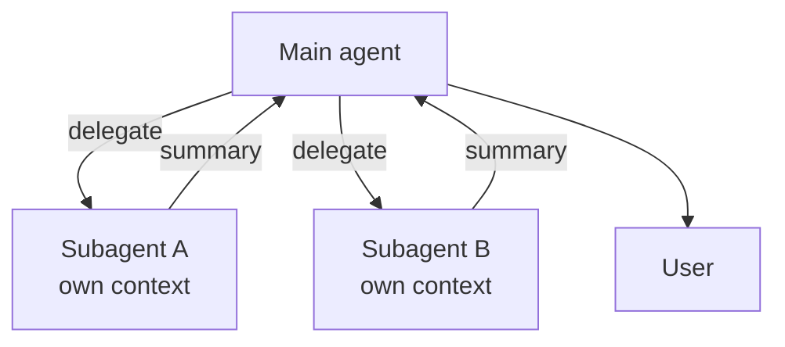
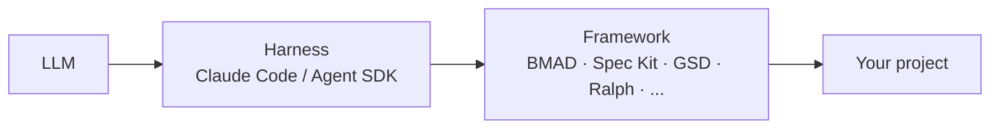
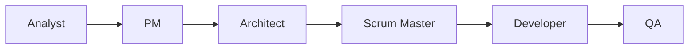
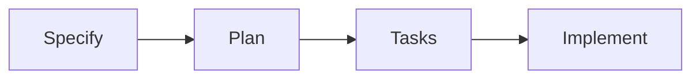

# 5 · Subagents

Specialized workers, isolated context, parallel execution

---
layout: two-cols-header
---

# What is a subagent?

A **subagent** is a specialized AI assistant with its own context window, system prompt, and tool access — invoked by the main agent to handle a focused task.

::left::

### What you get

- **Context isolation** — search noise stays out of main thread
- **Parallelism** — N subagents run concurrently
- **Constrained tools** — least-privilege per agent
- **Cheaper models** — route to Haiku when fitting
- **Reusable** — same prompt, every project

[📖 [code.claude.com/docs/en/sub-agents](https://code.claude.com/docs/en/sub-agents)]{.text-sm .opacity-60}

::right::

### Mental model



<!--
The single most important property: each subagent gets a FRESH context window.
That's why they're the answer to "I don't want this 10MB of grep output in my main session."
-->

---
layout: two-cols-header
---

# When to reach for a subagent

::left::

### ✅ Good fit

- Task floods main context (search, log dives, file scans)
- Repeatable specialist work (review, test gen, docs)
- Need different tool/permission scope
- Want a cheaper model for cheap work
- Multiple independent things → run in parallel

::right::

### ❌ Bad fit

- Single-step task (overhead > value)
- Quick edit you can do inline
- Decision the main agent already has context for
- Coordination across multiple sessions
  → use **agent teams** instead

<!--
The cost is real: spawning a subagent has latency and tokens. The win is when the alternative
is dragging 50k tokens of search results through the rest of your session.
-->

---

# Subagent anatomy

```
.claude/agents/code-reviewer.md       ← project-level (committed)
~/.claude/agents/code-reviewer.md     ← user-level (personal)
```

```yaml
---
name: code-reviewer
description: |
  Reviews staged diffs for bugs, style, and security issues.
  Use PROACTIVELY before commits or when the user asks for a review.
tools: Read, Grep, Glob, Bash         # least-privilege
model: sonnet                         # or haiku / opus / inherit
isolation: worktree                   # optional: own git worktree
---

You are a senior code reviewer for this team. When invoked:
1. Run `git diff --staged` to see the changes
2. Flag bugs, missing tests, and style violations
3. Return a punch-list grouped by severity
```

[The `description` is the trigger. Include "use PROACTIVELY" to encourage auto-delegation.]{.text-sm .opacity-70}

<!--
name = identifier; description = trigger condition; tools = capability gate; system prompt = behavior.
Same shape as Skills, but model-invokable as a *worker* with isolated context.
-->

---
class: text-sm
---

# Built-in subagents

Already shipped with Claude Code:

| Subagent              | Purpose                                            |
| --------------------- | -------------------------------------------------- |
| `general-purpose`     | Complex multi-step tasks, when no specialist fits  |
| `Explore`             | Fast read-only codebase search & answer location   |
| `Plan`                | Architect for designing implementation plans       |
| `claude-code-guide`   | Answer "how do I X in Claude Code?" questions      |
| `statusline-setup`    | Configure status line display                      |

```bash
# In-session
/agents                              # list, create, edit
@"code-reviewer (agent)" review the auth module
> use the Explore subagent to find all places that hit /api/billing
```

[📖 [code.claude.com/docs/en/sub-agents#built-in-subagents](https://code.claude.com/docs/en/sub-agents#built-in-subagents)]{.text-sm .opacity-60}


<!--
You usually don't have to *ask* for general-purpose / Explore — the main agent picks them up.
The pattern: small main thread, heavy lifting offloaded to specialist subagents.
-->

---

# Subagent vs Skill vs Slash command

|                  | Slash command   | Skill              | Subagent              |
| ---------------- | --------------- | ------------------ | --------------------- |
| Trigger          | User types `/x` | Model decides      | Model delegates       |
| Context          | Same thread     | Same thread        | **Own thread**        |
| Tools            | Inherits        | Inherits           | **Restricted**        |
| Parallelism      | No              | No                 | **Yes**               |
| Best for         | Fixed prompt    | Auto-loaded how-to | Heavy specialist work |

[Same project can use all three. They compose — a skill can call a subagent, a subagent can use commands.]{.text-sm .opacity-70}

<!--
Picking between them: if it's user-triggered, command. If it's "the model should know to do X
when Y", skill. If it floods context or wants its own scope, subagent.
-->

---
layout: section
---

# 6 · Plugins

Bundle commands · skills · agents · hooks · MCP servers — share with one install

---

# What is a plugin?

A **plugin** is a single distributable unit that bundles any combination of:

::div{.cards}

:::div
### 📜 Slash commands
Project-scoped prompts
:::

:::div
### 🧩 Skills
Auto-invoked expertise
:::

:::div
### 🤖 Subagents
Specialized workers
:::

:::div
### 🪝 Hooks
Lifecycle interceptors
:::

:::div
### 🔌 MCP servers
External tools/data
:::

:::div
### 🧠 LSP servers
Code intelligence
:::

::

[One install command → an entire team workflow lands in your `~/.claude/`.]{.text-sm .opacity-70}

<style scoped>
.cards { display: grid; grid-template-columns: repeat(3, 1fr); gap: 1rem; margin-top: 1.5rem; }
.cards > div { border: 1px solid rgb(55, 65, 81); border-radius: 0.375rem; padding: 0.75rem 1rem; }
.cards h3 { margin: 0 0 0.25rem 0; color: rgb(251, 146, 60); font-size: 0.95rem; }
</style>

<!--
A skill is *one* capability. A plugin is *many* capabilities packaged so a teammate gets the
whole stack with a single install — including the hooks and MCP wiring.
-->

---
class: text-sm
---

# Plugin anatomy

```
my-plugin/
├── .claude-plugin/
│   └── plugin.json              ← metadata only (name, version, deps)
├── commands/                    ← slash commands
│   └── deploy.md
├── skills/                      ← model-invoked skills
│   └── release-notes/SKILL.md
├── agents/                      ← subagents
│   └── code-reviewer.md
├── hooks/
│   └── hooks.json               ← lifecycle hook wiring
├── .mcp.json                    ← MCP servers shipped with the plugin
└── README.md
```

[⚠️ `plugin.json` is the **only** thing inside `.claude-plugin/`. Everything else lives at the plugin root.]{.text-sm .opacity-70}

```bash
# Test in development without installing
claude --plugin-dir ./my-plugin

# Inside a session — pick up changes
/reload-plugins
```

<!--
The structure mirrors what we've already seen — commands/, skills/, agents/, hooks/. The plugin
is just the packaging that lets you ship them all together.
-->

---
layout: two-cols-header
---

# Marketplace & distribution

::left::

A marketplace = a Git repo registry that lists many plugins.

```bash
# Add a marketplace
claude plugins marketplace add \
  https://github.com/anthropics/claude-plugins-official

# Install a plugin from it
claude plugins install <name>
```

Notable registries:

- **[anthropics/claude-plugins-official](https://github.com/anthropics/claude-plugins-official)** — Anthropic-curated
- **[claudemarketplaces.com](https://claudemarketplaces.com)** — community directory
- **[buildwithclaude.com](https://buildwithclaude.com)** — community directory

::right::

<div class="warning">

### ⚠️ Same supply-chain risk as skills

Plugins ship **hooks** and **MCP servers** — that's arbitrary code execution.

Before installing:
- Read `plugin.json` and `hooks/hooks.json`
- Check who maintains it
- Audit the MCP server configs (`.mcp.json`)

</div>

<style scoped>
.slidev-layout :deep(.col-left) { padding-right: 1.5rem; }
.slidev-layout :deep(.col-right) { padding-left: 1.5rem; }
.warning { border: 2px solid rgb(239, 68, 68); border-radius: 0.375rem; padding: 1rem; background: rgba(127, 29, 29, 0.2); }
</style>

<!--
Hooks + MCP = code that runs on your machine. The supply chain question matters here.
A 2-minute audit beats the worst case.
-->

---
layout: section
---

# 7 · Harness & frameworks

What sits *around* the loop — and the playbooks people layer on top

---

# What's a "harness"?

The **harness** is the runtime *around* the LLM that drives the loop, manages tools, context, permissions, hooks, compaction.

### Anthropic's harness — Claude Code itself

> Gather context → take action → verify → repeat.

- The **Claude Agent SDK** (formerly Claude Code SDK) exposes the same harness as a library
- Built-in: tool execution, context compaction, permission modes, hooks, subagents
- Single-threaded master loop — one flat message history
- Same engine powers Claude Code, Cowork, Design

[📖 [anthropic.com/engineering/building-agents-with-the-claude-agent-sdk](https://www.anthropic.com/engineering/building-agents-with-the-claude-agent-sdk)]{.text-sm .opacity-60}

<!--
The shift in framing: stop thinking "how do I prompt the model" and start thinking
"what does the harness around it do for me." That's where reliability comes from.
-->

---

# Why care about the harness?

If you're building **your own agent**, you don't have to write the loop. The Agent SDK gives you:

- File / bash / web tools out of the box
- Compaction so long runs don't OOM the context
- Hook events to gate dangerous actions
- Subagent + MCP plumbing

```ts
import { query } from "@anthropic-ai/claude-agent-sdk"

for await (const m of query({ prompt: "..." })) { ... }
```

[The harness is the reusable part — same engine, your prompts and tools.]{.text-sm .opacity-70}

<!--
Reliability comes from the harness, not the prompt. When you build on the SDK, you inherit
the same loop machinery that powers Claude Code itself.
-->

---

# Frameworks layer *workflows* on top

The harness runs the loop. **Frameworks** are opinionated playbooks that decide *what to put inside it.*



Two big families:

- **Spec-driven** — write a spec, then let agents implement it (BMAD, Spec Kit, GSD)
- **Loop-driven** — keep iterating until done (Ralph Wiggum)

[None of these *replace* Claude Code — they configure it. Most ship as plugins, prompts, or CLIs.]{.text-sm .opacity-70}

<!--
Important framing: frameworks are not competitors to Claude Code. They're configurations of it.
Pick one that fits how your team already works (or wants to work).
-->

---

# BMAD Method

**B**reakthrough **M**ethod for **A**gile **A**I-**D**riven **D**evelopment.

A multi-agent framework with **role-based personas** following an agile cycle:



- 4 phases: **Analysis → Planning → Solutioning → Implementation**
- Each role = a subagent with a focused system prompt
- Ships modules: BMM (core), BMB (builder), TEA (test arch), BMGD (game dev), CIS (creative)
- Open-source · 37k+ ⭐

<div class="pros-cons">
<div class="pros">

**✅ Strengths**

Predictability, ceremony, traceable artifacts (PRDs, stories, ACs)

</div>
<div class="cons">

**⚠️ Trade-off**

Heavy. Overkill for solo / small features.

</div>
</div>

[📖 [github.com/bmad-code-org/BMAD-METHOD](https://github.com/bmad-code-org/BMAD-METHOD)]{.text-sm .opacity-60}

<style scoped>
.pros-cons { display: grid; grid-template-columns: 1fr 1fr; gap: 1rem; margin-top: 1rem; margin-bottom: 1rem; }
.pros { border: 2px solid rgb(34, 197, 94); border-radius: 0.375rem; padding: 0.75rem 1rem; background: rgba(20, 83, 45, 0.2); }
.cons { border: 2px solid rgb(239, 68, 68); border-radius: 0.375rem; padding: 0.75rem 1rem; background: rgba(127, 29, 29, 0.2); }
.pros p, .cons p { margin: 0.25rem 0; }
</style>

<!--
BMAD = "agile + AI". If your team already lives in Jira / sprints / PRDs, BMAD maps cleanly.
If you ship one-person features in an afternoon, it's too much process.
-->

---

# GitHub Spec Kit

GitHub's open-source toolkit for **spec-driven development** with AI agents.

Four gated phases:



- **Specify** — describe goals + user journeys
- **Plan** — declare architecture, stack, constraints
- **Tasks** — break work into reviewable units
- **Implement** — agent works task-by-task, you verify

<div class="pros-cons">
<div class="pros">

**✅ Strengths**

Spec is the source of truth — code is its expression. Cross-agent.

</div>
<div class="cons">

**⚠️ Trade-off**

Upfront spec work. Pays off on multi-week features, not one-shots.

</div>
</div>

[📖 [github.com/github/spec-kit](https://github.com/github/spec-kit)]{.text-sm .opacity-60}

<style scoped>
.pros-cons { display: grid; grid-template-columns: 1fr 1fr; gap: 1rem; margin-top: 1rem; margin-bottom: 1rem; }
.pros { border: 2px solid rgb(34, 197, 94); border-radius: 0.375rem; padding: 0.75rem 1rem; background: rgba(20, 83, 45, 0.2); }
.cons { border: 2px solid rgb(239, 68, 68); border-radius: 0.375rem; padding: 0.75rem 1rem; background: rgba(127, 29, 29, 0.2); }
.pros p, .cons p { margin: 0.25rem 0; }
</style>

<!--
Spec Kit's pitch: the spec is a versioned artifact, agents and humans both work *from* it.
Reduces "the model went off the rails" because it has explicit gates.
-->

---

# GSD — Get Shit Done

A **context-engineering** framework that fights *context rot* — the quality decay that hits long sessions.

How it does it:

- Externalize state into files (specs, plans, decisions)
- Split work into small plans
- Run each plan in a **fresh subagent context**
- Verify output against explicit goals before moving on

**v2 is a standalone CLI** built on the Agent SDK — direct access to the harness:
clear context between tasks, manage git branches, detect stuck loops, auto-advance milestones.

<div class="pros-cons">
<div class="pros">

**✅ Strengths**

Long-running autonomy. Lightweight vs BMAD.

</div>
<div class="cons">

**⚠️ Trade-off**

Spec-driven — same upfront cost.

</div>
</div>

[📖 [github.com/gsd-build/gsd-2](https://github.com/gsd-build/gsd-2)]{.text-sm .opacity-60}

<style scoped>
.pros-cons { display: grid; grid-template-columns: 1fr 1fr; gap: 1rem; margin-top: 1rem; margin-bottom: 1rem; }
.pros { border: 2px solid rgb(34, 197, 94); border-radius: 0.375rem; padding: 0.75rem 1rem; background: rgba(20, 83, 45, 0.2); }
.cons { border: 2px solid rgb(239, 68, 68); border-radius: 0.375rem; padding: 0.75rem 1rem; background: rgba(127, 29, 29, 0.2); }
.pros p, .cons p { margin: 0.25rem 0; }
</style>

<!--
GSD's core insight: the bottleneck isn't model intelligence, it's context degradation.
The whole framework is "how do I keep the context clean as I run for hours."
-->

---

# Ralph Wiggum

> *"Me fail English? That's unpossible!"* — Ralph

Geoffrey Huntley's **brute-force loop technique**:

```bash
while true; do claude < prompt.md; done   # the original — one bash line
```

Feed Claude a task + completion criterion. Claude works, tries to exit, a Stop hook **blocks the exit** and feeds the same prompt back. Repeats until the criterion is met.

- Anthropic ships an **official `ralph-wiggum` plugin** (`anthropics/claude-code/plugins/ralph-wiggum`)
- Huntley used it for a **3-month autonomous run** that built a programming language
- Ethos: "brute force meets persistence"

<div class="pros-cons">
<div class="pros">

**✅ Strengths**

Zero ceremony. Surprisingly effective on well-scoped tasks.

</div>
<div class="cons">

**⚠️ Trade-off**

Burns tokens. No checkpoints. Trust = test coverage.

</div>
</div>

[📖 [ghuntley.com/ralph](https://ghuntley.com/ralph) · [anthropics/claude-code/plugins/ralph-wiggum](https://github.com/anthropics/claude-code/tree/main/plugins/ralph-wiggum)]{.text-sm .opacity-60}

<style scoped>
.pros-cons { display: grid; grid-template-columns: 1fr 1fr; gap: 1rem; margin-top: 1rem; margin-bottom: 1rem; }
.pros { border: 2px solid rgb(34, 197, 94); border-radius: 0.375rem; padding: 0.75rem 1rem; background: rgba(20, 83, 45, 0.2); }
.cons { border: 2px solid rgb(239, 68, 68); border-radius: 0.375rem; padding: 0.75rem 1rem; background: rgba(127, 29, 29, 0.2); }
.pros p, .cons p { margin: 0.25rem 0; }
</style>

<!--
Ralph is the anti-framework. No personas, no phases, no ceremony — just "loop until done."
It works because compaction + tool use + retries is enough on a clear task with a clear test.
-->

---

# Picking one (or none)

| Framework      | Style          | Sweet spot                              | Cost       |
| -------------- | -------------- | --------------------------------------- | ---------- |
| **Anthropic harness** | Bare metal | Build your own agent (Agent SDK)    | DIY        |
| **BMAD**       | Agile multi-agent | Team features, sprints, PRD-driven   | Heavy      |
| **Spec Kit**   | Spec-driven    | Cross-agent shops, versioned specs       | Medium     |
| **GSD**        | Spec + harness | Long autonomous runs, context-rot fight  | Medium     |
| **Ralph**      | Loop-driven    | Well-scoped task, has a test, run overnight | Tokens   |

[None of these are **required**. The default Claude Code setup with skills + a tight `CLAUDE.md` covers most daily work.]{.text-sm .opacity-70}

[Honourable mentions: **Superpowers**, **GSTACK**, **Pulumi's** orchestration patterns — same family.]{.text-sm .opacity-70}

<!--
Don't adopt a framework before you have a problem it solves. The progression is:
naked Claude Code → CLAUDE.md → skills → subagents → plugin → framework. Stop where the pain stops.
-->

---
layout: center
class: text-center
---

# 🎯 End of Theory 2

You now have the **full stack**:

LLM → harness → tools → memory → commands → skills → **subagents → plugins → frameworks**

Time to package some of it.

<!--
Recap: Theory 1 was the loop and how to shape it. Theory 2 was how to scale it (subagents),
share it (plugins), and structure long work (frameworks). Now hands-on 2 ties it together.
-->
